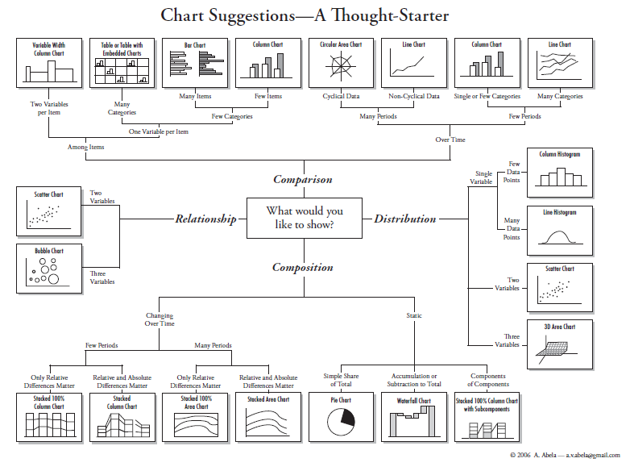

## Module 4 Data Plotting 

### Tools

There is an incredible number of tools for visualizing data.  Some are listed below.  

* excel
* [Tableau](https://www.tableau.com/trial/tableau-software?utm_campaign_id=2017049&utm_campaign=Prospecting-CORE-ALL-ALL-ALL-ALL&utm_medium=Paid+Search&utm_source=Google+Search&utm_language=EN&utm_country=USCA&kw=tableau&adgroup=CTX-Brand-Priority-Core-E&adused=ETA&matchtype=e&placement=&gclid=CjwKCAiAy9jyBRA6EiwAeclQhAtzHelr0sWQy_ijlrd8XLMgXQaz_aG9fWAk0XTdgTLnpOcBe69E9hoCJqoQAvD_BwE&gclsrc=aw.ds)
* [KNIME with JavaScript](https://www.knime.com/nodeguide/visualization/javascript)
* [ggplot (R)](https://ggplot2.tidyverse.org/)
* [D3.js (javascript)](https://d3js.org/)
* [Python via Matplotlib](https://matplotlib.org/)
* [Python via Pandas](https://pandas.pydata.org/pandas-docs/stable/user_guide/visualization.html)
* [mpld3](https://mpld3.github.io/)

In this class we will focus in Matplotlib (Python), Pandas (Python) and MPLD3 (Python)

### Chart Suggestions

The below chart is useful as a thought starter.  First think about whether you are plotting a comparison, relationship, distribution, or composition.  Then follow the flow chart.

  