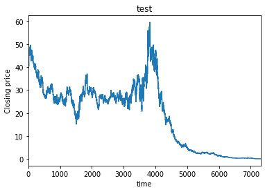
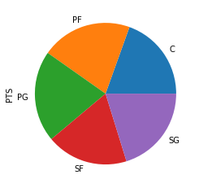

# Visualization with Python via Pandas

An alternative to using Matplotlib on Python structures (such as arrays and lists) is to Plot using methods of Pandas ```DataFrames```.  When do you use each method?

1.  If your data is easy to read from Pandas using ```read_csv``` or ```read_fwf```, and you are doing fairly standard plots it may be more convenient to plot directly from Pandas. 
2.  If your data is not easy to read from Pandas, and is not already in a ```Dataframe``` or you are trying to do specialized plots it may be more convenient to plot using ```Matplotlib```.

There are several example notebooks that show how to plot directly from Pandas. 

## Using Pandas for line plot

Download and work through this [notebook](https://github.com/bnorthan/inf-428-data-analytics-online/blob/master/python/notebooks/visualization/PandasLine.ipynb) to learn how to create a line plot directly from Pandas. 




## Using Pandas for scatter plot

Download and work through this [notebook](https://github.com/bnorthan/inf-428-data-analytics-online/blob/master/python/notebooks/visualization/PandasScatter.ipynb) to learn how to create a scatter plot directly from Pandas.   

Note that the example also shows how to place to Pandas plots in a figure by using some ```Matplotlib``` tricks, and passing a pre-generated axis to the ```plot.scatter``` function.  

```  python 
import matplotlib.pyplot as plt
plt.figure(figsize=(8,8))
ax1=plt.subplot(1,2,1)
ax2=plt.subplot(1,2,2)
basketball_stats.plot.scatter('BLK','PTS',ax=ax1)
basketball_stats.plot.scatter('Age','PTS',ax=ax2)
```


## Using Pandas and groupby for bar and pie chars 

Download and work through this [notebook](https://github.com/bnorthan/inf-428-data-analytics-online/blob/master/python/notebooks/visualization/PandasGroupbyBarPie.ipynb) to learn how to use groupby to precondition data for plotting bar and pie charts.  





