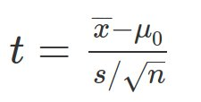

## Hypothesis Testing

Read [What is Hypothesis Testing](https://stattrek.com/hypothesis-test/hypothesis-testing.aspx)

## Null Hypothesis

The term "null hypothesis" usually refers to a general statement or default position that there is no relationship between two measured phenomena, or no difference among groups.  

This can be confusing to students as we ussually use statistical techniques to reject the null hypothesis.  So 

1.  The null hypothesis is no Difference between between groups.
2.  We often attempt to reject the null hypothesis. 
3.  If we reject the null hypothesis that means there is a difference between groups. 

## Null Hypothesis example

1.  We want to test a new drink that is suppose to improve a runner's 5k time. 
2.  We test two groups, one that consumes the drink, one that does not, then both groups run a 5k. 
3.  The null hypothesis is that there is no difference between the groups.  Their 5k times will be the same. 
4.  If we reject the null hypothesis then there is a difference between the groups and the drink did effect the runners 5k time. 

## P-Values

Read [538 Scientists explain p-values](https://fivethirtyeight.com/features/not-even-scientists-can-easily-explain-p-values/)  

The p-value is the probability of obtaining the observed sample results (or a more extreme result) when the null hypothesis is actually true.  

## Single Sample T-test

* T-value is calculated as follows  
   
* then p is calculated from a table  
* [T-test table to determine p](https://www.sjsu.edu/faculty/gerstman/StatPrimer/t-table.pdf)  
* Read [Wikipedia Explanation](https://en.wikipedia.org/wiki/Student%27s_t-test#One-sample_t-test)  
* The single sample t-test tests whether a population mean is different from a test value.  The null hypothesis is that there is no difference.  If we reject the null hypothesis the poplulation mean is different from the test value. 

## INDEPENDENT (UNPAIRED) SAMPLES

* Tests if mean values are different between two samples
* Example: blood pressure between two groups (men and women)
* [Read Wikipedia Explanation](https://en.wikipedia.org/wiki/Student%27s_t-test#Independent_.28unpaired.29_samples) 

## PAIRED SAMPLES
* Tests if mean values are different when a group is tested twice  
* Example: blood pressure before and after a treatment
* [Read Wikipedia Explanation](https://en.wikipedia.org/wiki/Student%27s_t-test#Paired_samples)  

